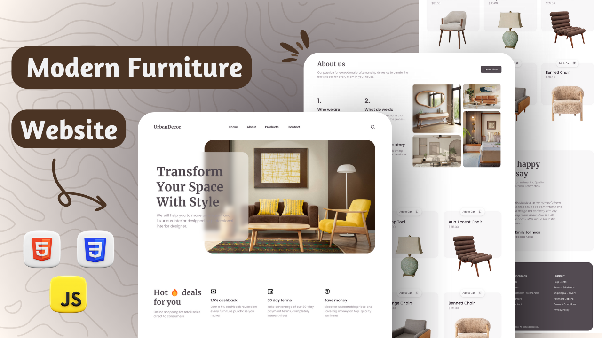

<div align="center">
  


[](https://twitter.com/intent/follow?screen_name=withaarzoo)
[](https://youtu.be/KXymZtuRRyk)

  <br />
  <br />

  <h2 align="center">Modern Furniture Website</h2>

  Welcome to the Modern Furniture Website project! This repository contains the HTML, CSS, and JS code for creating a stylish and responsive website to showcase modern furniture collections.

  <div>
    <a href="https://youtu.be/KXymZtuRRyk"><strong>➥ Watch Tutorial</strong></a>
    <br>
    <br>
    <a href="tel:+917586073575"><strong>➥ Download Full Source Code : +91 7586073575 ( WhatsApp )</strong></a>
  </div>

</div>

## Getting Started

To get started with the Modern Furniture Website, follow these steps:

1. Clone the repository to your local machine:

```bash
git clone https://github.com/withaarzoo/Furniture-Website--UrbanDecor.git
```

2. Open the project in your favorite code editor.

3. Explore the files and start customizing the content to fit your website's needs.

## Essential Links

- Remix Icon : [visit site](https://ionic.io/ionicons)
- Google Fonts : [visit site](https://www.emailjs.com/)
- Scroll Reveal CDN : [visit site](https://scrollrevealjs.org/guide/installation.html)
- swiper CDN : [visit site](https://swiperjs.com/get-started#use-swiper-from-cdn)

## Source Code

You can find the complete source code for the Modern Furniture Website on WhatsApp:

- +917586073575 ( WhatsApp )

## Video Tutorial

Need some extra guidance? Watch our video tutorial on setting up and customizing your website:

- [Modern Furniture Website Tutorial](https://youtu.be/KXymZtuRRyk)

## Connect with Me

If you want to contact me you can reach me at [Twitter](https://twitter.com/withaarzoo).

## Thumbnail



---

**Happy Coding!** 🚀
